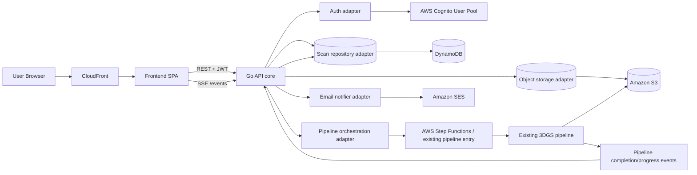

# Ariadne — управление 3D-реконструкцией и просмотр результатов

## 1) Цель проекта

`Ariadne` — это продуктовый слой над уже развернутым и проверенным AWS-пайплайном реконструкции из репозитория:

`guidance-for-open-source-3d-reconstruction-toolbox-for-gaussian-splats-on-aws`

Задача `Ariadne`:
- дать пользователю простой UX: **загрузить видео → дождаться обработки → посмотреть результат**;
- дать backend/API для управления заданиями реконструкции;
- обеспечить уведомления:
  - в интерфейсе: прогресс + завершение;
  - на email: уведомление о завершении.

---

## 2) Требования (фаза архитектуры)

### Функциональные
- Пользователь может создать скан (upload видео).
- Пользователь видит свои сканы со статусами:
  - `in_progress`
  - `completed`
- Пользователь может открыть карточку скана и просмотреть результат (3D-ассет + метаданные).
- Сканы строго принадлежат пользователю (tenant boundary по `user_id`).
- API доступно наружу (публичная документация).
- На фронтенд приходят обновления прогресса и событие завершения.
- На почту приходит уведомление о завершении.

### Нефункциональные
- Backend: **Go**, запускается **отдельно от AWS** (cloud-agnostic core).
- Production-размещение backend: **EC2** (через CDK), но код backend не должен быть жестко привязан к AWS SDK/API.
- Интеграция frontend ↔ backend: **REST** (дополнительно SSE-стрим поверх HTTP для realtime событий).
- Авторизация: **AWS-managed** (Cognito).
- Frontend доставка: **CloudFront**.

---

## 3) High-Level архитектура



### Ключевая идея интеграции
`Ariadne` **не переизобретает** вычислительный пайплайн. Она управляет существующим pipeline-слоем:
1. создает запись скана;
2. принимает upload/референс на видео;
3. запускает pipeline (через Step Functions/S3 job-trigger, в зависимости от текущей точки входа);
4. получает прогресс/завершение;
5. обновляет scan state;
6. уведомляет UI и email.

При этом backend проектируется как **core + adapters**:
- `core` (домен, use-cases, REST handlers) не зависит от AWS;
- AWS подключается через адаптеры (Cognito, DynamoDB, S3, SES, Step Functions);
- для локального/альтернативного запуска можно подменять адаптеры (например, local storage + SMTP/mock notifier + локальный orchestrator client).

---

## 4) AWS-интеграции для production-контура (backend-centric)

## В production (AWS) используем
- **EC2 (Go API)**
  - REST API, авторизация JWT, бизнес-логика сканов.
  - Launch Template + Auto Scaling (минимум 1 инстанс для старта).
- **Application Load Balancer (ALB)**
  - TLS termination, routing к EC2.
- **Amazon Cognito (User Pool + App Client)**
  - AWS-native авторизация пользователей.
  - JWT access/id token для frontend.
- **DynamoDB (`scans` table)**
  - хранение scan metadata/status/progress/result links.
- **S3 input/output buckets**
  - входные видео и выходные артефакты реконструкции.
- **Step Functions / существующий pipeline trigger**
  - фактический запуск 3DGS pipeline.
- **CloudFront**
  - отдача frontend (S3 static origin или custom origin).
- **SES (или SNS email topic)**
  - email-уведомления о завершении.

## Важно: автономный запуск backend
- Backend должен стартовать **без AWS-инфры** (например, локально/в отдельной среде).
- AWS-сервисы подключаются только через интерфейсы/адаптеры.
- Минимальный standalone-режим:
  - auth adapter: local dev JWT/provider;
  - repository: PostgreSQL/SQLite (или in-memory для dev);
  - object storage: local filesystem/MinIO;
  - notifier: SMTP/mock;
  - pipeline client: HTTP client к уже развернутому pipeline endpoint или stub.

## Опциональные (рекомендуемые)
- **EventBridge/SQS** между pipeline callbacks и API для надежной доставки событий.
- **ElastiCache Redis** для fan-out realtime событий при горизонтальном масштабировании API.
- **WAF** перед CloudFront/ALB.
- **CloudWatch + X-Ray** для observability.

---

## 5) Backend-домен и состояния

## Сущность `Scan`
- `scan_id` (UUID)
- `user_id` (from Cognito `sub`)
- `status` (`in_progress` | `completed` | `failed` internal)
- `progress_percent` (0..100)
- `input_video_s3_key`
- `result_asset_url` (signed URL или CDN URL)
- `preview_thumbnail_url`
- `pipeline_job_id` (id в Step Functions/Batch/SageMaker)
- `created_at`, `updated_at`, `completed_at`
- `error_message` (internal)

> Во frontend показываем минимум: `in_progress`, `completed`. `failed` можно включить позже в UI, но backend хранит для эксплуатационной прозрачности.

---

## 6) REST API (v1)

## Auth
- `Authorization: Bearer <JWT from Cognito>`
- Все `/v1/scans/*` scoped на текущего пользователя.

## Endpoints

### Создать скан
`POST /v1/scans`

Варианты:
1) multipart upload (`video` файл)
2) presigned URL flow:
   - `POST /v1/uploads` → получить `upload_url`
   - frontend грузит напрямую в S3
   - `POST /v1/scans` с `input_video_s3_key`

Response:
```json
{
  "scan_id": "uuid",
  "status": "in_progress",
  "progress_percent": 0
}
```

### Список сканов текущего пользователя
`GET /v1/scans?cursor=...&limit=20`

### Детали скана
`GET /v1/scans/{scan_id}`

### События прогресса/завершения (frontend notifications)
`GET /v1/scans/{scan_id}/events`

- SSE stream (`text/event-stream`)
- события:
  - `scan.progress`
  - `scan.completed`
  - `scan.failed`

### Публичная документация API
`GET /docs`
- OpenAPI 3.1 + Swagger UI/ReDoc (наружу).

---

## 7) Потоки выполнения

## A. Создание скана
1. Пользователь логинится через Cognito.
2. Frontend загружает видео (лучше direct-to-S3 через presigned URL).
3. Frontend вызывает `POST /v1/scans`.
4. API создает запись в DynamoDB со статусом `in_progress`.
5. API запускает существующий pipeline (Step Functions start / S3 job trigger).
6. API возвращает `scan_id`.

## B. Обновление прогресса
1. Pipeline публикует прогресс (event/callback).
2. API обновляет `progress_percent` в DynamoDB.
3. SSE endpoint пушит событие во frontend.

## C. Завершение
1. Pipeline завершает работу и пишет артефакты в S3 output.
2. API получает completion callback/event.
3. API ставит `status=completed`, фиксирует ссылки на результат.
4. API отправляет email (SES/SNS email).
5. Frontend получает `scan.completed` и обновляет UI.

---

## 8) Авторизация и безопасность

- Identity: Cognito User Pool.
- API проверяет JWT и извлекает `sub` как `user_id`.
- Любые запросы к сканам фильтруются по `user_id`.
- S3 доступ:
  - upload через короткоживущие presigned URL;
  - download результатов через signed URL/CloudFront signed cookies.
- Шифрование:
  - S3 SSE-KMS,
  - DynamoDB encryption at rest,
  - TLS везде.
- IAM least privilege для EC2 instance role.

---

## 9) Observability и эксплуатация

- CloudWatch Logs:
  - API access/error logs,
  - pipeline callback logs.
- CloudWatch Metrics/Alarms:
  - количество активных `in_progress` сканов,
  - среднее время реконструкции,
  - % failed jobs,
  - API p95 latency.
- Correlation ID:
  - `scan_id` проходит через API, orchestration и уведомления.

---

## 10) Развертывание (целевой контур)

### Режим A — standalone backend (без AWS-зависимостей)
- Запуск Go-сервиса как обычного приложения (`docker compose`/systemd/Kubernetes).
- Конфигурация через env (`AUTH_PROVIDER`, `DB_PROVIDER`, `STORAGE_PROVIDER`, `MAIL_PROVIDER`, `PIPELINE_PROVIDER`).
- Используются не-AWS адаптеры или заглушки.

### Режим B — AWS production (через CDK)
- Frontend: S3 + CloudFront.
- Backend: Go service на EC2 за ALB.
- Auth: Cognito.
- Data: DynamoDB + S3.
- Pipeline orchestration: reuse existing deployed 3DGS stack.
- Notifications: SES (email) + SSE (frontend realtime).

CDK отвечает за инфраструктуру, но backend остается переносимым сервисом с конфигурируемыми адаптерами.

---

## 11) Roadmap (следующие шаги после этого README)

1. Зафиксировать контракт интеграции с текущим pipeline:
   - где стартуем job,
   - в каком формате получаем прогресс/complete callback.
2. Сформировать OpenAPI v1 (minimal):
   - `/v1/uploads`, `/v1/scans`, `/v1/scans/{id}`, `/v1/scans/{id}/events`.
3. Собрать skeleton backend на Go в стиле `core + adapters`:
   - HTTP router, JWT middleware, интерфейсы портов (`AuthProvider`, `ScanRepository`, `ObjectStorage`, `PipelineClient`, `Notifier`).
4. Сделать две сборки адаптеров:
   - `aws` (Cognito/DynamoDB/S3/SES/StepFunctions),
   - `standalone` (local/pgsql/minio/smtp или mock).
5. Поднять базовый frontend:
   - login, create scan, list scans, scan details viewer page.
6. Настроить IaC для AWS-контура через CDK.

---

## 12) Принципы границ ответственности

- Existing 3DGS pipeline отвечает за вычисление реконструкции.
- Ariadne отвечает за:
  - user-facing product API,
  - ownership и доступ к сканам,
  - lifecycle/status/progress,
  - UX уведомлений,
  - публикацию API-документации.
