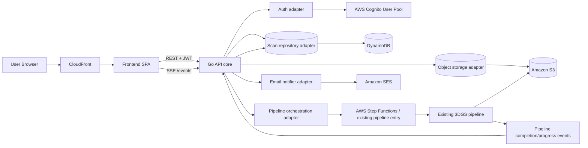

# Splatmaker — manage 3D reconstruction and view results

## 1) Project goal

`Splatmaker` is a product layer built on top of an already deployed and validated AWS reconstruction pipeline from the repository:

`guidance-for-open-source-3d-reconstruction-toolbox-for-gaussian-splats-on-aws`

Splatmaker’s mission:
- provide a simple UX: **upload video → wait for processing → view result**;
- provide a backend/API to manage reconstruction jobs;
- provide notifications:
  - in UI: progress + completion;
  - by email: completion notification.

---

## 2) Requirements (architecture phase)

### Functional
- A user can create a scan (video upload).
- A user can view their scans with statuses:
  - `in_progress`
  - `completed`
- A user can open a scan details page and view the result (3D asset + metadata).
- Scans strictly belong to the user (tenant boundary by `user_id`).
- API is publicly accessible (public documentation).
- Frontend receives progress updates and completion events.
- Email notification is sent on completion.

### Non-functional
- Backend: **Go**, runs **independently from AWS** (cloud-agnostic core).
- Backend production placement: **EC2** (via CDK), but backend code must not be tightly coupled to AWS SDK/API.
- Frontend ↔ backend integration: **REST** (plus SSE stream over HTTP for real-time events).
- Authorization: **AWS-managed** (Cognito).
- Frontend delivery: **CloudFront**.

---

## 3) High-level architecture



### Core integration idea
`Splatmaker` does **not reinvent** the compute pipeline. It orchestrates the existing pipeline layer:
1. creates a scan record;
2. accepts upload/video reference;
3. starts pipeline execution (via Step Functions/S3 job trigger, depending on current entry point);
4. receives progress/completion updates;
5. updates scan state;
6. notifies UI and email.

At the same time, backend is designed as **core + adapters**:
- `core` (domain, use cases, REST handlers) has no AWS dependency;
- business logic is also **database-agnostic**;
- data access goes through the `ScanRepository` port (interface), while concrete DBs are plugged in via adapters;
- AWS is connected through adapters (Cognito, DynamoDB, S3, SES, Step Functions);
- for local/alternative runtime, adapters can be swapped (e.g., local storage + SMTP/mock notifier + local orchestrator client).

---

## 4) AWS integrations for production environment (backend-centric)

## In production (AWS), use
- **EC2 (Go API)**
  - REST API, JWT authorization, scan business logic.
  - Launch Template + Auto Scaling (minimum 1 instance to start).
- **Application Load Balancer (ALB)**
  - TLS termination, routing to EC2.
- **Amazon Cognito (User Pool + App Client)**
  - AWS-native user authorization.
  - JWT access/id token for frontend.
- **DynamoDB (`scans` table)**
  - stores scan metadata/status/progress/result links.
- **S3 input/output buckets**
  - input videos and output reconstruction artifacts.
- **Step Functions / existing pipeline trigger**
  - actual 3DGS pipeline execution.
- **CloudFront**
  - frontend delivery (S3 static origin or custom origin).
- **SES (or SNS email topic)**
  - completion email notifications.

## Important: autonomous backend startup
- Backend must start **without AWS infrastructure** (e.g., locally/in a separate environment).
- AWS services are connected only through interfaces/adapters.
- Minimal standalone mode:
  - auth adapter: local dev JWT/provider;
  - repository: PostgreSQL/SQLite (or in-memory for dev);
  - object storage: local filesystem/MinIO;
  - notifier: SMTP/mock;
  - pipeline client: HTTP client to already deployed pipeline endpoint or stub.

## Optional (recommended)
- **EventBridge/SQS** between pipeline callbacks and API for reliable event delivery.
- **ElastiCache Redis** for real-time event fan-out under horizontal API scaling.
- **WAF** in front of CloudFront/ALB.
- **CloudWatch + X-Ray** for observability.

---

## 5) Backend domain and statuses

## `Scan` entity
- `scan_id` (UUID)
- `user_id` (from Cognito `sub`)
- `status` (`in_progress` | `completed` | `failed` internal)
- `progress_percent` (0..100)
- `input_video_s3_key`
- `result_asset_url` (signed URL or CDN URL)
- `preview_thumbnail_url`
- `pipeline_job_id` (id in Step Functions/Batch/SageMaker)
- `created_at`, `updated_at`, `completed_at`
- `error_message` (internal)

> In frontend, we display at minimum: `in_progress`, `completed`. `failed` can be added later in UI, but backend keeps it for operational transparency.

---

## 6) REST API (v1)

## Auth
- `Authorization: Bearer *** from Cognito>`
- All `/v1/scans/*` endpoints are scoped to current user.

## Endpoints

### Create scan
`POST /v1/scans`

Options:
1) multipart upload (`video` file)
2) presigned URL flow:
   - `POST /v1/uploads` → get `upload_url`
   - frontend uploads directly to S3
   - `POST /v1/scans` with `input_video_s3_key`

Response:
```json
{
  "scan_id": "uuid",
  "status": "in_progress",
  "progress_percent": 0
}
```

### List current user scans
`GET /v1/scans?cursor=...&limit=20`

### Scan details
`GET /v1/scans/{scan_id}`

### Progress/completion events (frontend notifications)
`GET /v1/scans/{scan_id}/events`

- SSE stream (`text/event-stream`)
- events:
  - `scan.progress`
  - `scan.completed`
  - `scan.failed`

### Public API docs
`GET /docs`
- OpenAPI 3.1 + Swagger UI/ReDoc (public).

---

## 7) Execution flows

## A. Create scan
1. User logs in via Cognito.
2. Frontend uploads video (prefer direct-to-S3 via presigned URL).
3. Frontend calls `POST /v1/scans`.
4. API creates a DynamoDB record with status `in_progress`.
5. API starts existing pipeline (Step Functions start / S3 job trigger).
6. API returns `scan_id`.

## B. Progress updates
1. Pipeline publishes progress (event/callback).
2. API updates `progress_percent` in DynamoDB.
3. SSE endpoint pushes event to frontend.

## C. Completion
1. Pipeline completes and writes artifacts to S3 output.
2. API receives completion callback/event.
3. API sets `status=completed`, stores result links.
4. API sends email (SES/SNS email).
5. Frontend receives `scan.completed` and updates UI.

---

## 8) Authorization and security

- Identity: Cognito User Pool.
- API validates JWT and extracts `sub` as `user_id`.
- All scan requests are filtered by `user_id`.
- S3 access:
  - upload via short-lived presigned URLs;
  - result download via signed URL/CloudFront signed cookies.
- Encryption:
  - S3 SSE-KMS,
  - DynamoDB encryption at rest,
  - TLS everywhere.
- IAM least privilege for EC2 instance role.

---

## 9) Observability and operations

- CloudWatch Logs:
  - API access/error logs,
  - pipeline callback logs.
- CloudWatch Metrics/Alarms:
  - number of active `in_progress` scans,
  - average reconstruction time,
  - % failed jobs,
  - API p95 latency.
- Correlation ID:
  - `scan_id` propagates through API, orchestration, and notifications.

---

## 10) Deployment (target environments)

### Mode A — standalone backend (without AWS dependencies)
- Run Go service as a regular app (`docker compose`/systemd/Kubernetes).
- Configure via env (`AUTH_PROVIDER`, `DB_PROVIDER`, `STORAGE_PROVIDER`, `MAIL_PROVIDER`, `PIPELINE_PROVIDER`).
- Non-AWS adapters or stubs are used.

### Mode B — AWS production (via CDK)
- Frontend: S3 + CloudFront.
- Backend: Go service on EC2 behind ALB.
- Auth: Cognito.
- Data: DynamoDB + S3.
- Pipeline orchestration: reuse existing deployed 3DGS stack.
- Notifications: SES (email) + SSE (frontend realtime).

CDK provisions infrastructure, while backend remains a portable service with configurable adapters.

---

## 11) Roadmap (next steps after this README)

1. Finalize integration contract with the current pipeline:
   - where jobs are started,
   - format of progress/complete callbacks.
2. Prepare minimal OpenAPI v1:
   - `/v1/uploads`, `/v1/scans`, `/v1/scans/{id}`, `/v1/scans/{id}/events`.
3. Build Go backend skeleton in `core + adapters` style:
   - HTTP router, JWT middleware, port interfaces (`AuthProvider`, `ScanRepository`, `ObjectStorage`, `PipelineClient`, `Notifier`).
4. Implement two adapter bundles:
   - `aws` (Cognito/DynamoDB/S3/SES/StepFunctions),
   - `standalone` (local/pgsql/minio/smtp or mock).
5. Build baseline frontend:
   - login, create scan, list scans, scan details viewer page.
6. Set up IaC for AWS environment via CDK.

---

## 12) Responsibility boundaries

- Existing 3DGS pipeline is responsible for reconstruction computation.
- Splatmaker is responsible for:
  - user-facing product API,
  - ownership and access to scans,
  - lifecycle/status/progress,
  - UX notifications,
  - API documentation publishing.
